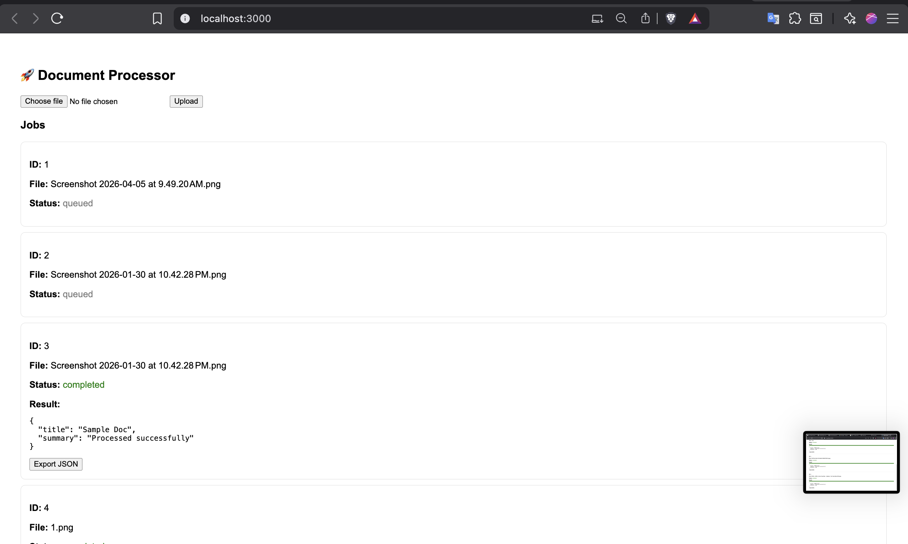

# 🚀 Async Document Processing System

## 🔧 Tech Stack
- FastAPI (Backend)
- React (Frontend)
- Celery (Background Jobs)
- Redis (Pub/Sub + Broker)
- SQLite / PostgreSQL

## ✨ Features
- Upload documents
- Async processing using Celery
- Real-time progress (WebSocket + Redis Pub/Sub)
- Retry failed jobs
- Export results

## ▶️ How to Run

[▶️ Watch Demo](https://drive.google.com/file/d/1E3zU2ElXpgF0Ablmt-rurGcwA3TqdEY9/view?usp=sharing)

## 📸 Screenshots

### Backend
cd backend
pip install -r requirements.txt
uvicorn app.main:app --reload

### Celery Worker
celery -A celery_worker.celery worker --loglevel=info --pool=solo

### Frontend
cd frontend
npm install
npm start

